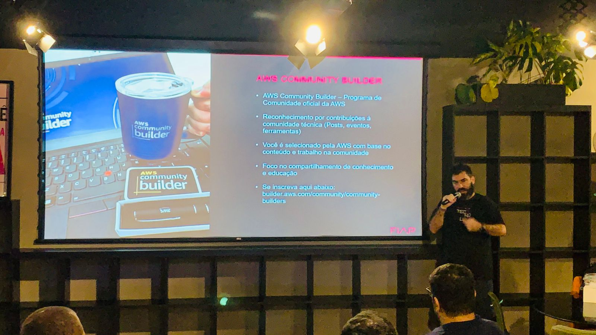
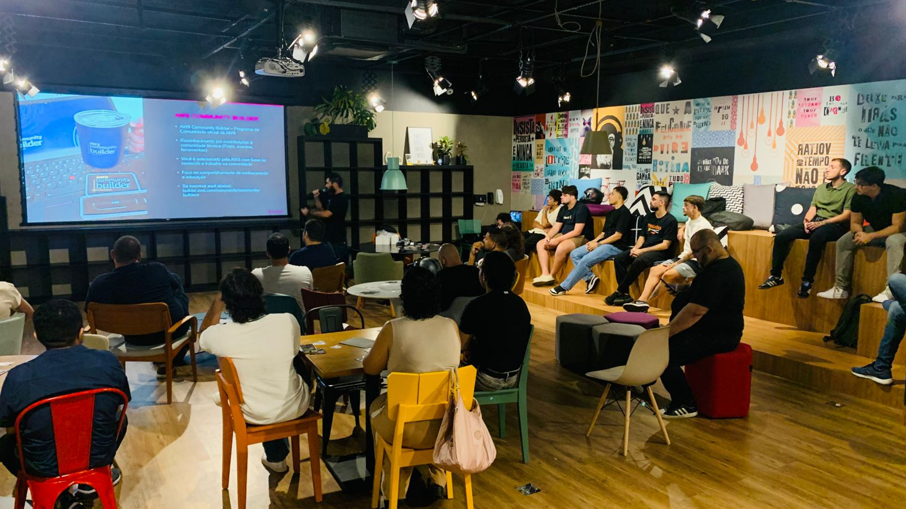
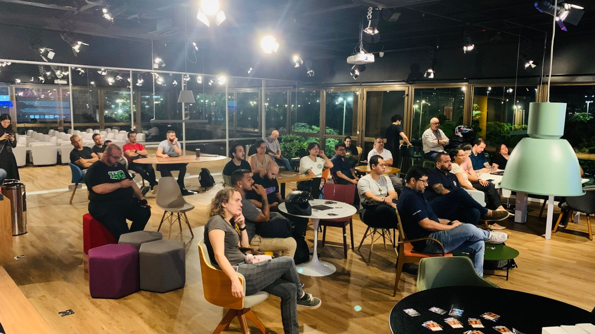
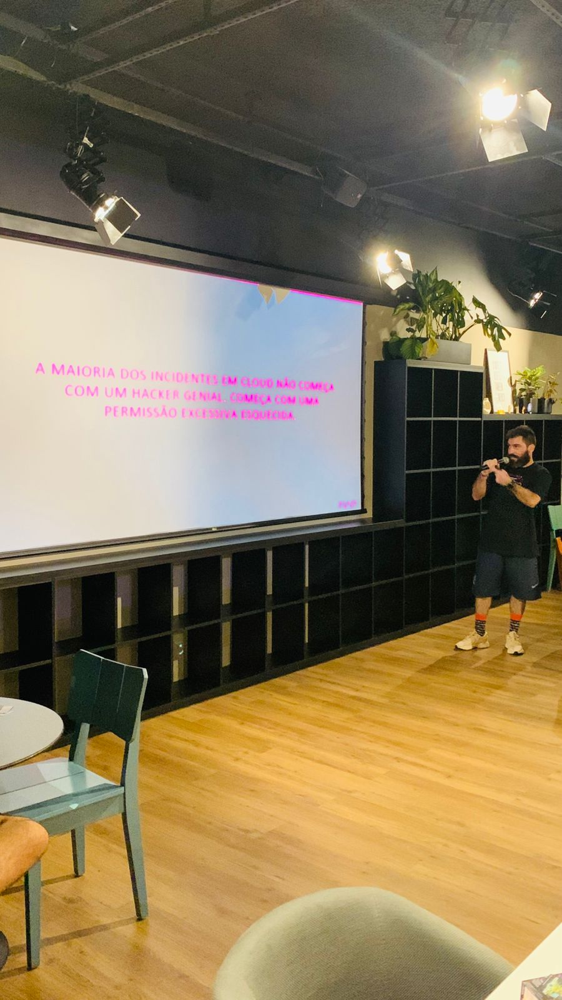
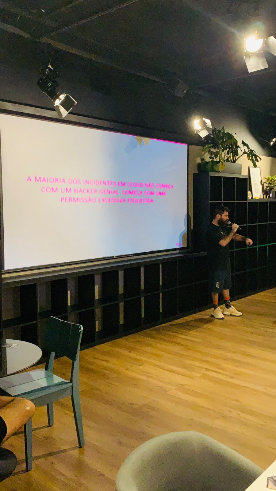

## Informações sobre o evento
No dia 25 de março, o Hack In Brasil recebe Amaury Borges Souza para uma palestra sobre segurança em ambientes AWS.

Com mais de 12 anos de experiência em segurança da informação, Amaury atua como Senior Cloud Security Engineer, é professor de MBA na FIAP, além de 3× AWS Community Builder e 3× HashiCorp Ambassador.

Na palestra **“10 Verificações Rápidas para Saber se Sua Conta AWS Está Realmente Segura”**, ele apresenta um checklist prático usado nos primeiros minutos ao acessar uma conta AWS — focado em identificar rapidamente o nível real de maturidade de segurança.

📅 25 de março
⏰ 19h às 22h
📍 FIAP – R. Marquês de Olinda, 11, Botafogo – RJ
Site do evento: https://hackinbrasil.com.br/meetup-25-03-2026/

---

sdsd